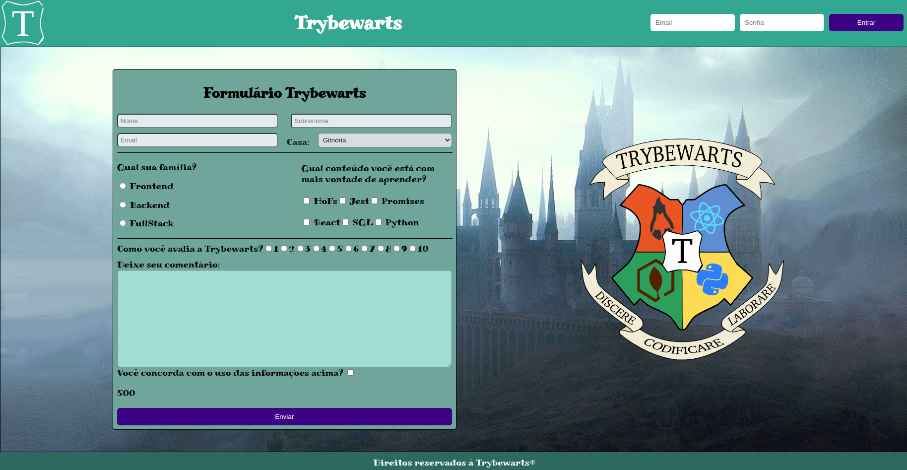

# Project-TrybeWartst :beginner:
Projeto realizado para conquistar aprovação no Bloco 6 (HTML e CSS: Forms, Flexbox e Responsivo) do curso da Trybe.

O objetivo desse projeto foi criar uma página HTML, com o auxilio do CSS Flexbox e tornar essa página responsiva, para ser utilizada em diversos tamanhos de tela, também foi utilizado JavaScript para desenvolver alguns elementos e validações do formulário, o formulário não utiliza nenhum método de envio de informações.

### Demosntração do Projeto:
</img>;

### Link para acessar o projeto: https://jeancarlos-sc.github.io/projetos/to-do-list/
